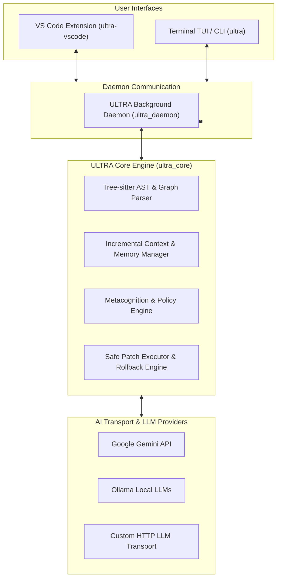

# ULTRA (UltraInfinity) - AI-Native Operating Shell & Developer Copilot


**ULTRA** (UltraInfinity) is a high-performance, C++20-powered AI-native operating shell and autonomous developer copilot framework. Designed for deep code intelligence, real-time repository indexing, and safe contextual refactoring, ULTRA seamlessly bridges low-level system performance with state-of-the-art Large Language Models (LLMs) such as Google Gemini, local Ollama models, and custom AI inference endpoints.

---

## 🌟 Key Features

- **🚀 C++20 Core Architecture:** Built from the ground up in high-performance C++20, ensuring minimal memory footprint, rapid startup, and zero-latency context indexing.
- **🌳 Tree-sitter AST & Semantic Graph:** Multi-language structural parsing for C++, Python, JavaScript, TypeScript, Java, Go, Rust, and C# using direct AST extraction and dependency graph building.
- **🧠 Multi-Model AI Routing Engine:** Dynamic LLM dispatch engine supporting Google Gemini, local Ollama servers, OpenAI-compatible APIs, and custom HTTP transport layers.
- **⚡ Safe Patch & Rollback System:** Automated code patch generation with dry-run validation, unit test execution, and transactional single-command rollback mechanisms.
- **🔌 Daemon & IPC Subsystem:** Background service architecture (`ultra_daemon`) communicating via lightweight IPC for seamless integration with IDEs and terminal applications.
- **🖥️ Dual Interface Options:**
  - **VS Code Extension (`ultra-vscode`):** Interactive sidebar panel, inline explain/fix/refactor actions, patch debugging, and health monitoring.
  - **Terminal TUI & CLI:** Rich interactive console for terminal-native developers.
- **🧩 Metacognitive Reasoning Engine:** Contextual diff analysis, workspace calibration, policy evolution, and incremental workspace graph maintenance.

---

## 🏗️ System Architecture



---

## 📂 Project Structure

```
UltraInfinity/
├── CMakeLists.txt              # Primary CMake build configuration (C++20)
├── ultra.json                  # Workspace configuration schema
├── include/                    # Public API headers & interfaces
│   └── ultra/                  # Core library headers & IPC protocols
├── src/                        # C++20 Core engine implementation
│   ├── ai/                     # LLM transport, HTTP clients & prompt routers
│   ├── ast/                    # Tree-sitter parsers & AST extraction
│   ├── cli/                    # Command-line parsing & router dispatch
│   ├── context/                # Workspace context building & file loading
│   ├── core/                   # System logging & utility modules
│   ├── diff/                   # Contextual diffing & unified patch generator
│   ├── engine/                 # Core reasoning pipeline orchestration
│   ├── graph/                  # Project dependency graph analysis
│   ├── ipc/                    # Inter-process communication logic
│   ├── metacognition/          # Self-improving policy & calibration rules
│   ├── patch/                  # Patch application, dry-runs, & rollback
│   └── platform/               # OS-specific process execution (Win32/Unix)
├── third_party/                # Embedded dependencies (Tree-sitter & grammars)
├── tui/                        # Terminal UI implementation
├── vscode-extension/           # Native VS Code Extension (TypeScript/JS)
└── tests/                      # Suite of unit & end-to-end C++ tests
```

---

## 🛠️ Prerequisites

Before building ULTRA, ensure you have the following installed on your system:

- **Compiler:** C++20 compliant compiler
  - Windows: MSVC v142 or newer (Visual Studio 2019 / 2022)
  - Linux/macOS: GCC 10+ or Clang 11+
- **Build System:** CMake `3.16` or higher
- **Node.js:** Node.js `v18.0.0` or higher (required for developing or packaging the VS Code extension)

---

## 📦 Building & Installation

### 1. Build C++ Core Binary & Libraries

Clone the repository and run the build steps:

```bash
# Clone the repository
git clone https://github.com/Madeswaranjv/UltraAI-Native-Operatingshell.git
cd UltraAI-Native-Operatingshell

# Generate CMake build files
cmake -B build -DCMAKE_BUILD_TYPE=Release

# Build executable and core library
cmake --build build --config Release
```

Upon successful compilation, the main executable (`ultra` / `ultra.exe`) and core static library (`ultra_core`) will be available in the `build/` directory.

### 2. Set Up VS Code Extension

```bash
cd vscode-extension
npm install
```

You can open `vscode-extension` in VS Code and press `F5` to launch an Extension Development Host with ULTRA enabled.

---

## 💻 Usage & Workflows

### CLI Commands

```bash
# Analyze project structure and run health diagnostic
ultra health

# Run automated bug detection & fixing pipeline
ultra task --fix "Fix null pointer dereference in IPC receiver"

# Generate code explanation
ultra task --explain "Explain tree-sitter AST extraction logic"

# Safe patch rollback
ultra rollback
```

### VS Code Extension Tasks

- **Fix Bug:** Analyzes selected error logs or source code and proposes safe atomic patches.
- **Explain Code:** Provides multi-level architectural and logic explanations using AST analysis.
- **Refactor:** Executes context-aware code refactoring.
- **Rollback Last:** Reverts the most recent applied patch instantaneously.
- **Health Check:** Runs workspace diagnostics and daemon connection verification.

---

## ⚙️ Configuration (`ultra.json`)

Configure ULTRA workspace parameters at the root of your project:

```json
{
  "ignore_dirs": ["build", ".git", ".vs"],
  "supported_extensions": [".cpp", ".hpp", ".h", ".py", ".ts", ".js", ".java", ".go", ".rs", ".cs"],
  "vendor_patterns": ["stb_", "glad", "nuklear", "minimp3"],
  "max_file_size_kb": 200
}
```

---

## 🧪 Testing

Run the C++ test suite using CTest:

```bash
ctest --test-dir build -C Release --output-on-failure
```

---

## 📜 License

This project is licensed under the MIT License - see the [LICENSE](LICENSE) file for details.
